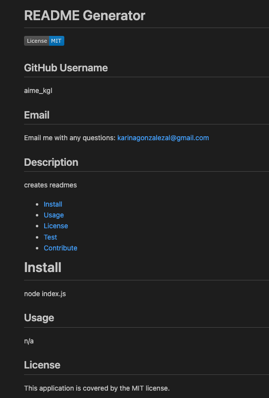

# README Generator

## Description

This project is created with the intentions of making a README file for your repos. 
This generator will facilite the process of creating a README. 
A README is an important part of your projects repositories as it contains very useful information including licenses and badges. 
I have learned more about README requirements and it's purpose along with learning about creating an app using NODE and NPM in the CLI.

## Installation

## Usage

Run node index.js in your terminal
Answer questions
Open newREADME on VS explorer

  

## Credits

Teacher/TA's
Tutor
Google

